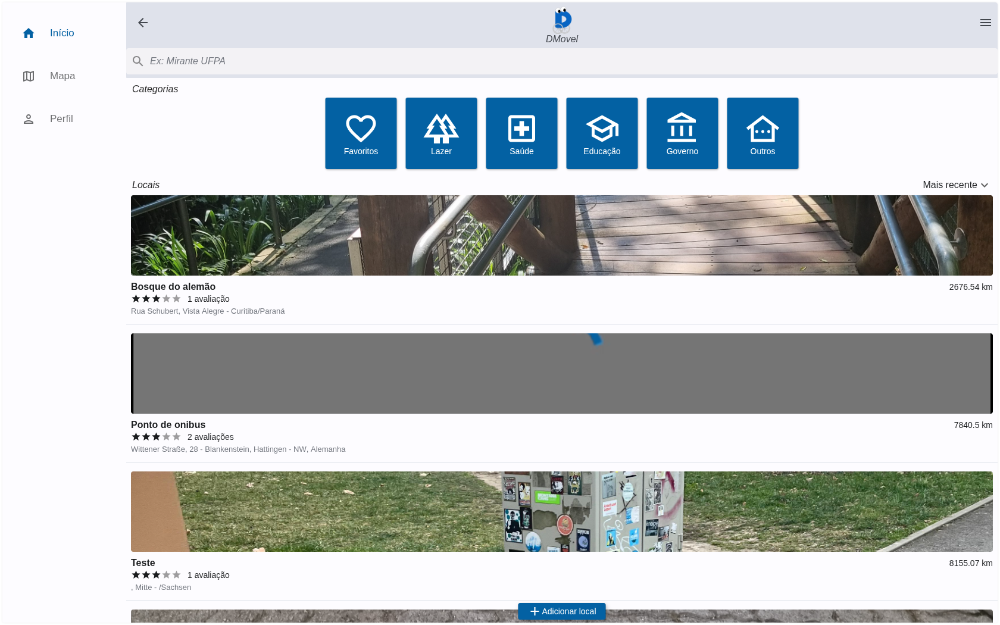
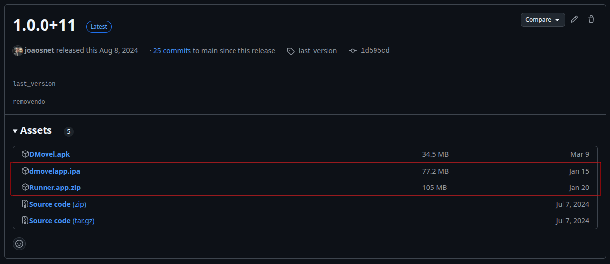

# Web aplicativo DMovel

Versão para navegadores do aplicativo DMovel criada apartir do comando  

```bash
  flutter build --render html
```


## Tela inicial




## Esse repo também armazena as versões executáveis
#### Android

que pode ser baixada em Releases


```bash
# criada apartir do comando 
  shorebird release android
```

#### e iOS



```bash
# criada apartir do comando usando macOS
  shorebird release ios
```